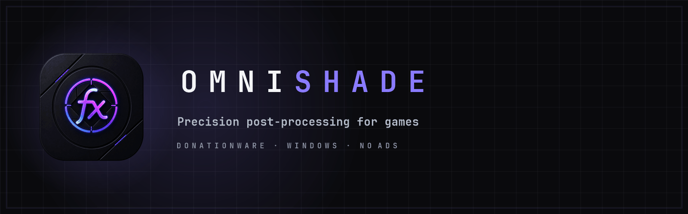
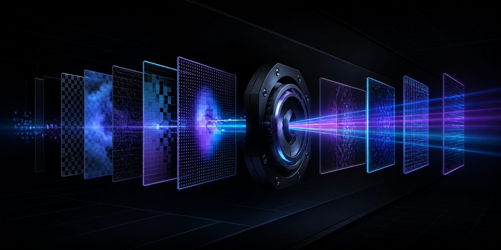
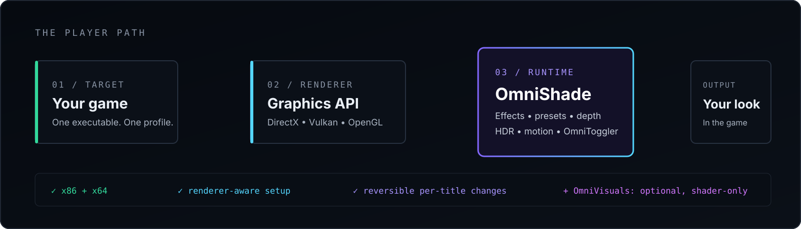
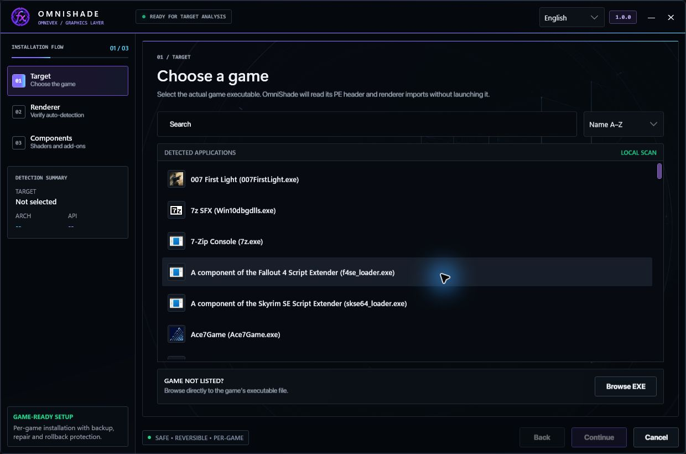
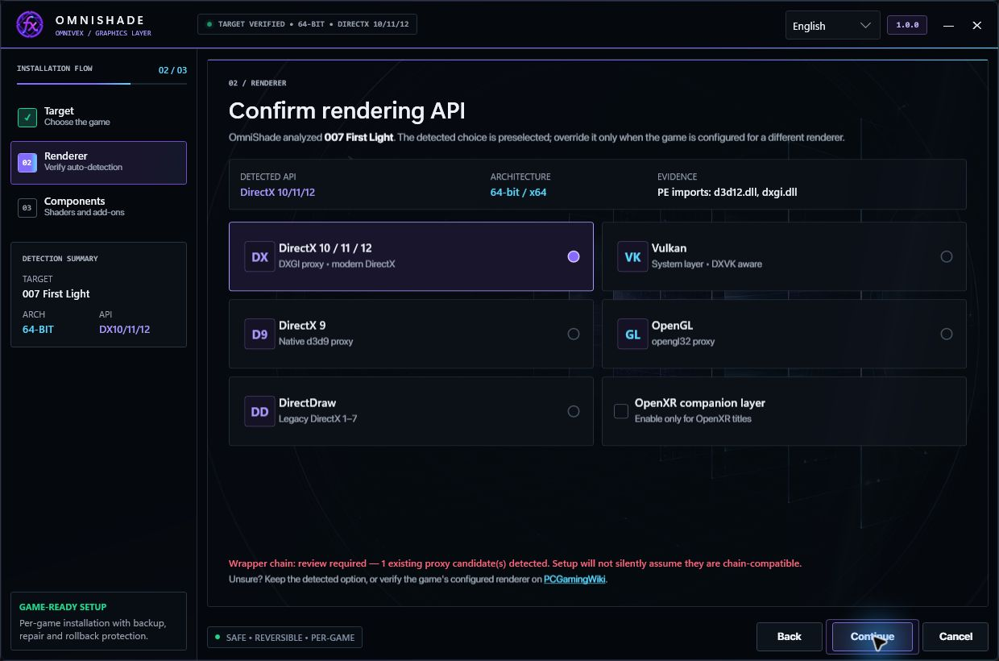
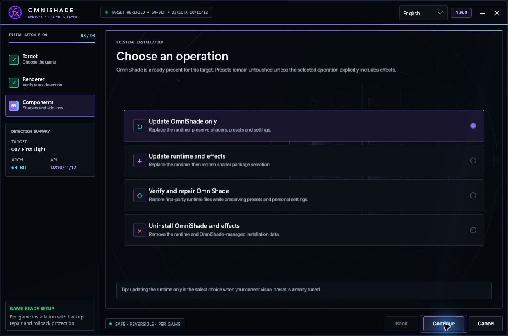
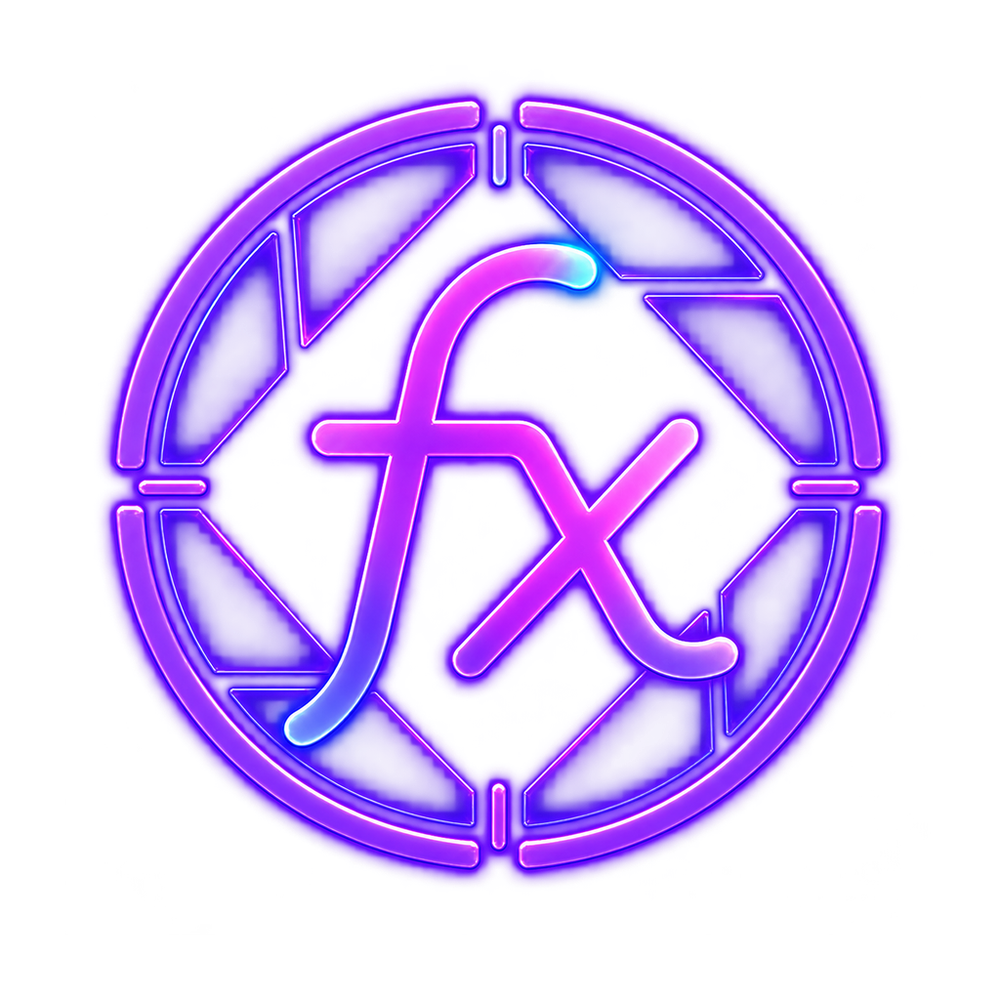

  

  
  
  
  
  

<!-- Quick navigation. Each chip jumps to a README section or maintained
     document. Keep the fragment links aligned with GitHub's heading slugs. -->

  
  
  
  
  
  
  
  
  

> [!IMPORTANT]
> This is OmniShade's **documentation and support repository**. It intentionally contains no source code, installer, runtime DLL, shader payload, preset archive, or GitHub Release. Official builds are distributed outside GitHub.

## Why OmniShade

OmniShade is a game-first, ReShade-derived post-processing runtime. It brings renderer-aware setup, dependable per-title recovery, a focused in-game interface, and a modern effects foundation together in one package—without turning ordinary play into a developer workflow.

| Game-aware | Reversible | Player-focused |
|---|---|---|
| Select the real game executable. Setup reads its architecture and renderer evidence without launching it. | Install, update, repair, and uninstall stay scoped to the selected title, with backup and recovery data. | Home, Game Profiles, Settings, Performance, Troubleshooting, and About—no capture lab or developer console in consumer builds. |

### One runtime, broad renderer coverage

OmniShade routes the correct native x86 or x64 runtime for Direct3D 9, Direct3D 10/11/12, DirectDraw, OpenGL, and Vulkan. Common DXVK and RTX Remix arrangements are recognized, and OpenXR-aware variants are available where the title and runtime path support them.

### Built for the image pipeline

The runtime provides ReShade FX compatibility, color and depth access, depth-input controls, cache-aware effect loading, HDR/color coordination, motion and temporal services for compatible effects, and integrated OmniToggler behavior without a separate consumer add-on DLL.

### Honest by design

OmniShade does not promise universal compatibility, guaranteed frame-rate gains, hardware ray tracing, or anti-cheat safety. The game, engine, graphics API, driver, wrapper chain, and exposed buffers still decide what is possible.

## How it fits together

**OmniShade is the runtime.** **OmniVisuals is the optional shader suite.** OmniVisuals remains shader-only, installs separately, and requires a genuine OmniShade installation. OmniToggler remains integrated into OmniShade.

## See it

<table>
  <tr>
    <td width="50%" valign="top">
       
      <strong>Choose the game.</strong> Search detected titles or browse directly to the actual executable.
    </td>
    <td width="50%" valign="top">
       
      <strong>Verify the renderer.</strong> Architecture, API, import evidence, and wrapper conflicts are visible before deployment.
    </td>
  </tr>
  <tr>
    <td colspan="2" align="center">
       
      <strong>Stay in control.</strong> Update only the runtime, modify effects, verify and repair, or remove OmniShade-managed files.
    </td>
  </tr>
</table>

## Feature highlights

- **Automatic architecture selection:** native 32-bit and 64-bit payloads chosen from the executable—not from a filename guess.
- **Renderer-aware deployment:** clear routing for modern DirectX, D3D9, DirectDraw, OpenGL, Vulkan, DXVK, RTX Remix, and optional OpenXR paths.
- **Wrapper-chain awareness:** existing proxy candidates are reported instead of silently overwritten or assumed compatible.
- **Depth Buffer 2.0 foundation:** depth-candidate management plus standard far-plane, upside-down, reversed, and logarithmic controls.
- **Modern effect runtime:** transactional reload, cache validation, bounded startup work, HDR/color metadata, and compatible temporal/motion coordination.
- **Integrated OmniToggler:** suppress selected game effects through the host runtime without shipping another consumer DLL.
- **Movable, resizable overlay:** a compact Omni Night interface that remembers bounded placement and keeps player tasks together.
- **Five complete languages:** English, Deutsch, Español, Français, and Română across Setup and the consumer runtime.
- **Gaming-only package:** no developer, capture, telemetry, calibration, or shader-analysis surfaces in normal builds.
- **No ads or required account:** local per-game operation with no OmniVex-operated gameplay telemetry service.

[Explore the complete consumer feature overview →](FEATURES.md)

## Requirements and compatibility

| Area | Requirement |
|---|---|
| OS | Windows 10 or Windows 11 |
| Architecture | x86 or x64 game executable |
| Graphics | A supported Direct3D, DirectDraw, OpenGL, or Vulkan path |
| Permissions | Write access to the selected game folder; some locations may require elevation |
| Online games | Check the publisher's modding and anti-cheat rules first; when injection is prohibited, do not use OmniShade |

Compatibility is game-specific. A supported API does not prove that every effect, depth path, overlay, or third-party wrapper will work in every title. See the [FAQ](FAQ.md) before assuming support.

## Getting OmniShade

OmniShade is **free donationware**: payment is not required, there are no ads, and support through Patreon or Ko-fi is entirely optional. GitHub intentionally hosts documentation and screenshots only—not the installer or source.

For the current build, distribution help, or a no-payment copy, contact **[omnivex@theomnigrid.biz](mailto:omnivex@theomnigrid.biz)**. If OmniShade is useful to you and you want to fund continued work, use either official page:

  
  &nbsp;&nbsp;
  

No payment is required. Please do not mirror the installer, runtime, or private delivery links; share this repository or the official support pages instead.

## Documentation

| Guide | What it covers |
|---|---|
| [Features](FEATURES.md) | Complete consumer-facing capability list and boundaries |
| [FAQ](FAQ.md) | Installation, compatibility, privacy, redistribution, and uninstall answers |
| [Support](SUPPORT.md) | Reproduction details, logs, privacy, and contact channels |
| [Security](SECURITY.md) | Private vulnerability reporting and safe disclosure |
| [Changelog](CHANGELOG.md) | OmniShade 1.0.0 highlights |
| [Repository notice](REPOSITORY_NOTICE.md) | Why this public repository contains documentation only |
| [Documentation license](LICENSE.md) | Rights applying to this public documentation and artwork |

## Support and feedback

Bug reports and feature requests are welcome through [GitHub Issues](https://github.com/TheOmniGrid/OmniShade/issues). Please remove usernames, local paths, account identifiers, and other personal information from logs or screenshots before posting. Security reports belong in private email, not a public issue.

## Independence and credits

OmniShade is an independent ReShade-derived distribution. ReShade is developed by its respective authors. OmniShade is not endorsed by or affiliated with ReShade, game publishers, GPU vendors, Patreon, or Ko-fi. Third-party licenses and required notices are included with authorized product distributions.

---

   
  Built by <strong>OmniVex</strong> · Free donationware · No ads · No gameplay telemetry

